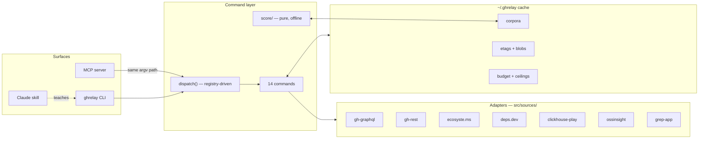

# Architecture

> **Mode: explanation.** Why github-relay is shaped the way it is. For exact command behavior
> see [`commands.md`](./commands.md); for the settled hard-to-reverse decisions see
> [`decisions/`](./decisions/); for the full panel-reviewed spec see
> [`DESIGN-v1.0.md`](./DESIGN-v1.0.md).

## Context and goals

Three problems make GitHub research harder than it looks:

1. **Recall**: keyword search misses repos that are good at something but not named after it,
   and GitHub caps any query at 1,000 results.
2. **Signal**: raw stars are gameable (fake-star campaigns cost ~$0.45/star at scale) and
   popularity says nothing about maintenance, real usage, or code quality.
3. **Token economy**: agents that read whole repos during exploration burn context on
   candidates they discard.

github-relay answers with a **gated funnel** (cheap wide net → offline ranking → targeted
forensics → bounded extraction), **multi-source signal fusion** with per-signal provenance, and
a **cost-declared command set** where nothing expensive can run by accident. Constraints that
shaped everything: single user, zero paid APIs, one free zero-permission PAT, no LLM anywhere in
the tool itself (the calling agent brings the intelligence).

## The shape

**Three surfaces, one command layer.** The MCP server and CLI share the exact same `run(argv)`
path — MCP tools build argv and add nothing else. The skill is generated from the same command
registry at build time. One source of truth (`src/commands/registry.ts`) drives help, dispatch,
MCP tool listing, and skill content, so the surfaces cannot drift independently. *(See ADR-003.)*

**Adapters own all network.** Each external host has exactly one module in `src/sources/`, built
on injectable seams (`fetchImpl`, `sleep`, `now`, `exec`, `WriteSink`) so the entire suite runs
on fakes. Adapters throw typed `EngineError`s; the command layer's `guard()` maps them to the
envelope with per-code hints. Everything network-touching is strictly serialized — no
`Promise.all` exists in a hot path.

**Scoring is pure and offline.** `src/score/` never sees a network object. `rank` re-scoring is
free by construction, and the calibration fixtures (known-good must outrank known-junk, per
profile) pin the model's *ordering* as a regression contract without pretending the weights are
ground truth.

**The cache is the session memory.** Corpora carry the research intent, every query run, and
per-signal provenance `{value, source, fetchedAt}` — so staleness is visible (`dataAge`),
follow-up sessions merge instead of restart, and conflicting signal writes are auditable. ETag
revalidation (quota-free 304s) plus content-addressed blob/tree/tarball stores make repeat
research converge toward zero cost.

## Data flow of one session

1. **Discovery** (`plan` → `search`/`batch`/`hydrate`/`code`/trending) unions five lanes into
   one corpus, deduped by case-insensitive `owner/repo` with rename tracking via GraphQL node id.
2. **Enrichment** (`enrich`) batches a ~15-signal GraphQL fragment (aliased, 25/batch, adaptive
   bisection on timeouts with learned, expiring ceilings) and walks the real-usage fallback
   chain: ecosyste.ms → deps.dev → visible `nodata`.
3. **Ranking** (`rank`) reads only the corpus. Missing groups renormalize; every row carries
   `coverage`; penalties need objective conditions or corroboration.
4. **Forensics** (`health`) completes the picture for ≤10 finalists: one ClickHouse POST for
   lifetime star histograms (burstiness, fake-star corroboration), issue latency, bus factor.
5. **Extraction** (`skim` → `read` → `digest`) climbs the ladder cheapest-first: cached blob →
   ETag 304 → tree+README → per-file → tarball → blobless clone. Never
   `raw.githubusercontent.com`, never HTML scraping, never hosted digest services.

## Failure philosophy

Two regimes, deliberately different *(see ADR-002)*:

- **Our bugs fail loud.** Malformed responses, invalid input, and contract violations throw
  typed errors immediately — never a silent `null` that poisons downstream scoring.
- **Goodwill services degrade visibly.** ecosyste.ms, deps.dev, ClickHouse, OSS Insight, and
  grep.app are free community endpoints. Any failure there downgrades the affected signal
  (`nodata`, `fCoverage:"partial"`, an open circuit breaker) for that repo only — a run is
  never aborted, and completed work always persists.

The same asymmetry governs deletion: `cache clear`/`gc` require a `.ghrelay` ownership marker
before touching anything, because "operator mispointed an env var" is a plausible event and
"tool deleted unrelated files" is an unacceptable outcome.

## Key decisions

| Decision | Where argued |
|----------|--------------|
| Stars never rank; license is metadata, never a filter | [ADR-001](./decisions/ADR-001-stars-never-rank-license-never-filters.md) |
| Zero paid APIs; goodwill lanes degrade, never abort | [ADR-002](./decisions/ADR-002-zero-paid-apis-degrade-not-abort.md) |
| One registry drives CLI + MCP + skill | [ADR-003](./decisions/ADR-003-single-registry-three-surfaces.md) |
| Scoring model, weights, penalty policy | [DESIGN-v1.0.md §5](./DESIGN-v1.0.md) (panel-settled, erratum noted inline) |
| Milestones, deferred v0.2 items | [PLAN.md](../PLAN.md) |
